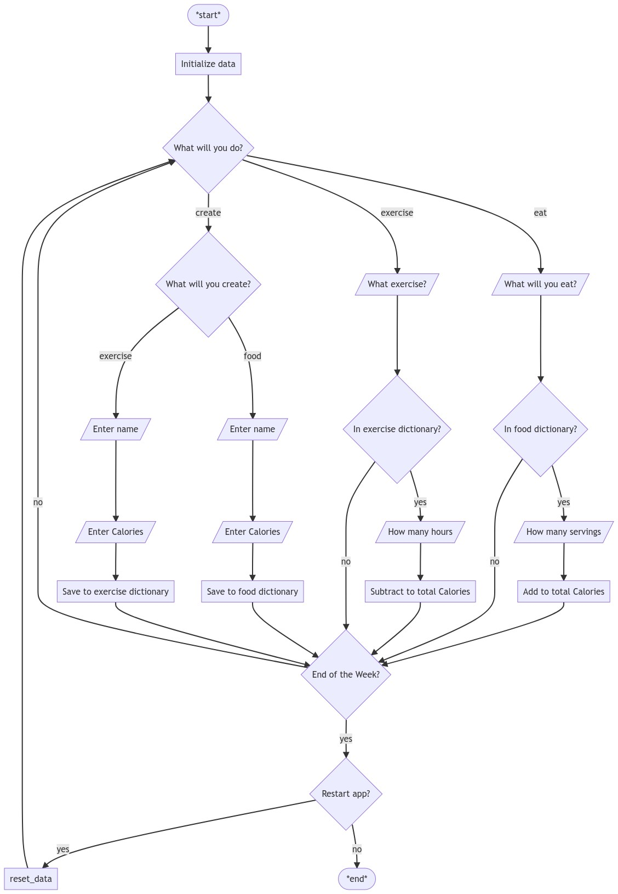

# CS4_Q1_Week6_FoodAndExercise

## Learning Objective

* Create an array or ArrayList containing different data
* Loop over the different indices of the arrays and ArrayLists to check and use the content

## Task

Similar to Exercise 2, create a Food class to contrast the Exercise class that you are given. Modify the classes such that any newly created instance is placed in a static HashMap of the class.

In the main method, create a loop such that the day is displayed and the user is asked whether to eat, exercise, or create. If either eat or exercise is entered, the user is prompted to enter what to eat/exercise and the amount. If create is selected, the user specifies he will add a new exercise or food, and will then be prompted for the name and calories.

### Flowchart



### Notes

* If you go through the entire array without finding a match, you can print the "no record" statement
* When restarting the week, the created food and exercises remain, but the day starts back to Monday. 

### Sample run 1

```
INITIALIZE DATA: 

New food 'chicken' created.
New food 'fish' created.
New exercise 'walk' created.
New exercise 'cycle' created.


START WEEKLY LOG: 


It is Monday. What will you do? (eat, exercise, create) eat
What will you eat? chicken
How many servings will you eat? 2
You ate chicken and consumed 478 Calories.


It is Tuesday. What will you do? (eat, exercise, create) exercise
What exercise will you do? rowing
There is no record of the exercise 'rowing'.


It is Wednesday. What will you do? (eat, exercise, create) create
What will you create? (exercise, food) exercise
What is the name of the exercise? rowing
How many Calories? 600
New exercise 'rowing' created.


It is Thursday. What will you do? (eat, exercise, create) exercise
What exercise will you do? rowing
How many hours will you exercise? 3
You have exercised for 3 hour(s) and burned 1800 Calories.


It is Friday. What will you do? (eat, exercise, create) sleep


It is Saturday. What will you do? (eat, exercise, create) play


It is Sunday. What will you do? (eat, exercise, create) pray

This week's net calorie total is -1322
Restart weekly log? (y/n) n
```

### Sample run 2

```
INITIALIZE DATA: 

New food 'chicken' created.
New food 'fish' created.
New exercise 'walk' created.
New exercise 'cycle' created.


START WEEKLY LOG: 


It is Monday. What will you do? (eat, exercise, create) study 


It is Tuesday. What will you do? (eat, exercise, create) eat
What will you eat? fish
How many servings will you eat? 1
You ate fish and consumed 206 Calories.


It is Wednesday. What will you do? (eat, exercise, create) study


It is Thursday. What will you do? (eat, exercise, create) study


It is Friday. What will you do? (eat, exercise, create) study


It is Saturday. What will you do? (eat, exercise, create) study


It is Sunday. What will you do? (eat, exercise, create) study

This week's net calorie total is 206
Restart weekly log? (y/n) y


It is Monday. What will you do? (eat, exercise, create) study


It is Tuesday. What will you do? (eat, exercise, create) study


It is Wednesday. What will you do? (eat, exercise, create) exercise
What exercise will you do? walk
How many hours will you exercise? 1
You have exercised for 1 hour(s) and burned 300 Calories.


It is Thursday. What will you do? (eat, exercise, create) study


It is Friday. What will you do? (eat, exercise, create) study


It is Saturday. What will you do? (eat, exercise, create) study


It is Sunday. What will you do? (eat, exercise, create) study

This week's net calorie total is -300
Restart weekly log? (y/n) n
```

## Procedure

1. Open a Java REPL 
2. Copy-Paste the Code Template
3. Run the code to see if it runs
4. Edit the code so that the output matches the sample run as close as possible
5. Run the code in the corresponding VPL activity for evaluation
6. Adjust your code until you get a happy score before the deadline passes

## Code Template

Use 4 separate files.

1. Main.java
2. Exercise.java
3. Food.java  
4. Person.java

### Main.java

```java

public class Main{

	public static void main(String[] args){

    System.out.println("\n\nINITIALIZE DATA: \n");
    
		new Food("chicken", 239);
		new Food("fish", 206);
		new Exercise("walk", 300);
		new Exercise("cycle", 700);

    System.out.println("\n\nSTART WEEKLY LOG: ");
    
    Person p = new Person("Arci");
    p.startWeeklyLog();
    
	}
}
```

### Exercise.java

```java

import java.util.HashMap;

public class Exercise {
	private String name;
	private int calories;
  public static HashMap<String, Exercise> ExerciseMap = new HashMap<>();
	
	public Exercise(String n, int c){
		name = n;
		calories = c;
		ExerciseMap.put(n, this);
		System.out.println("New exercise '" + n + "' created.");
	}
	public String getName(){
		return name;
	}
	public int getCalories(){
		return calories;
	}
}
```

### Food.java

```java


/////// CHANGE ANY PART OF THIS CODE TO SOLVE THE PROBLEM 
  
public class Food {

  String name;
  int calories;

  
  public Food(String n, int c){
    name = n;
    calories = c;

  }

}
```

### Person.java

```java
/////// CHANGE ANY PART OF THIS CODE TO SOLVE THE PROBLEM

import java.util.Scanner;

public class Person{

  String name;
  int netCalories = 0;

  static Scanner input = new Scanner(System.in);

  
  public Person(String n){
    name = n;
  }


  
  public void startWeeklyLog(){
    String[] days = {"Monday", "Tuesday", "Wednesday", "Thursday", "Friday", "Saturday", "Sunday"};

    String restartWeek = "no";
    
    do{ 
      for (int i=0; i< days.length; i++){
        String day = days[i];
        System.out.print("\n\nIt is " + day + ". What will you do? (eat, exercise, create) ");
        String ans = input.nextLine();
  


        
        
        }
        System.out.println("\nThis week's net calorie total is " + netCalories);
          
        System.out.print("Restart weekly log? (y/n) ");
        restartWeek = input.nextLine();

      //reset net calorie count;
      netCalories = 0;

    }while(restartWeek.equals("y"));
      
  }
}
```

## Assessment Criteria

Your code's grade is directly proportional to the number of tests passed.

## Due Date 

Please submit this on or before the assigned due date (around Q1 Week 6 or Week 7).

